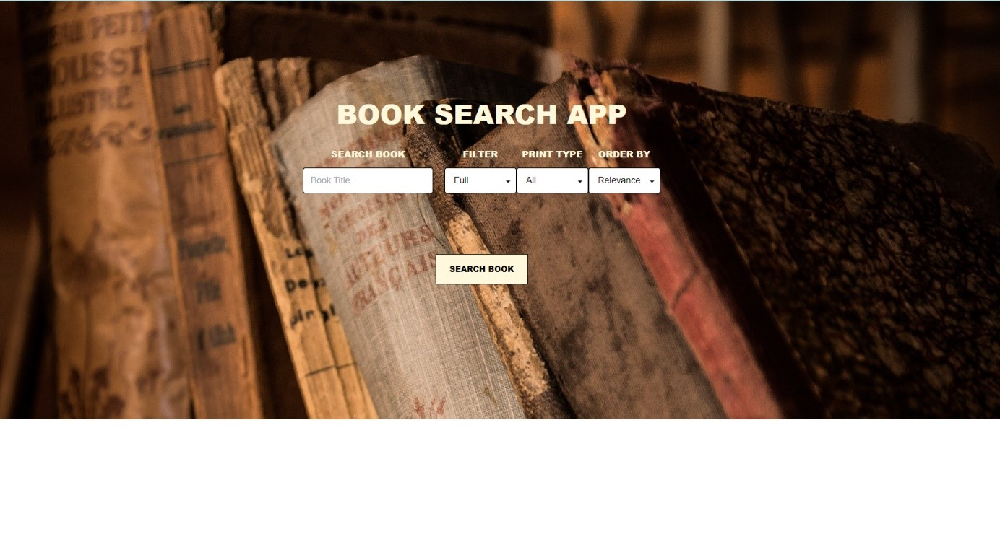
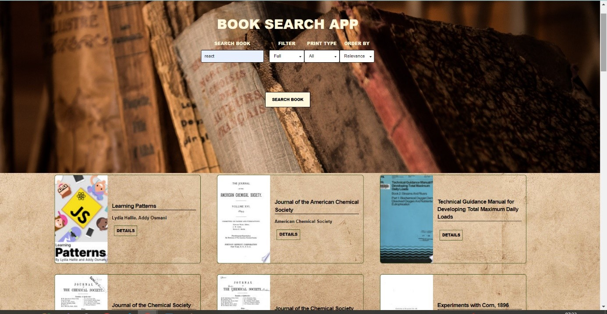
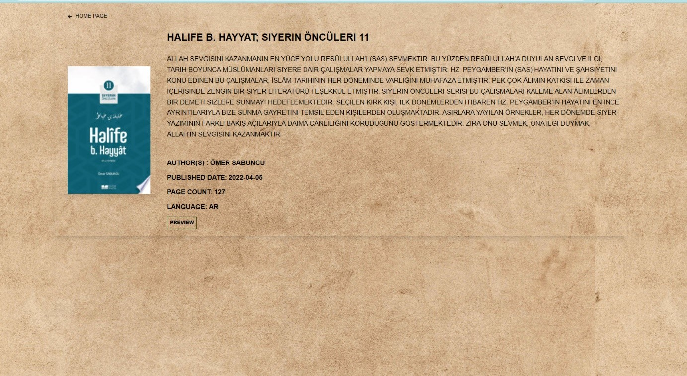
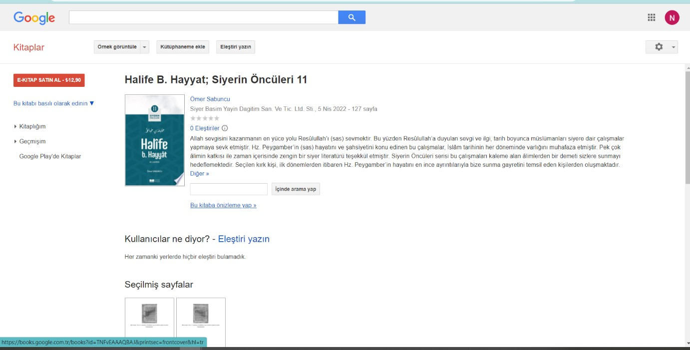

# Patika-Odev-6
FMSS Bilişim Front-end Practicum Ödev-6

Görev: Google Books API veya herhangi başka bir API ile kullanıcıların kitap veya yazar ismi yazarak kitap arayabileceği bir servis geliştirmek

Ödev Ana Sayfa Tasarımı :

Kullanıcının belirlemiş olduğu filtreler ve search Input değerine göre uygun seçenekle apiden alınan dataya göre listeleniyor...

Kitap Detay Sayfası: 
Kitaba ait üst/alt başlık yazar,basım yılı,sayfa sayısı ve hangi dilde yazıldığı bilgileri kullanıcıya veriliyor...

 Preview butonuyla  ilgili kitabın Google Kitaplar sayfasına yönlendirilmesi sağlanıyor
 

Css olarak Tailwincss; API Google Books API kullanılmıştır

### Live : [https://nurpatikaodev6.netlify.app/]
